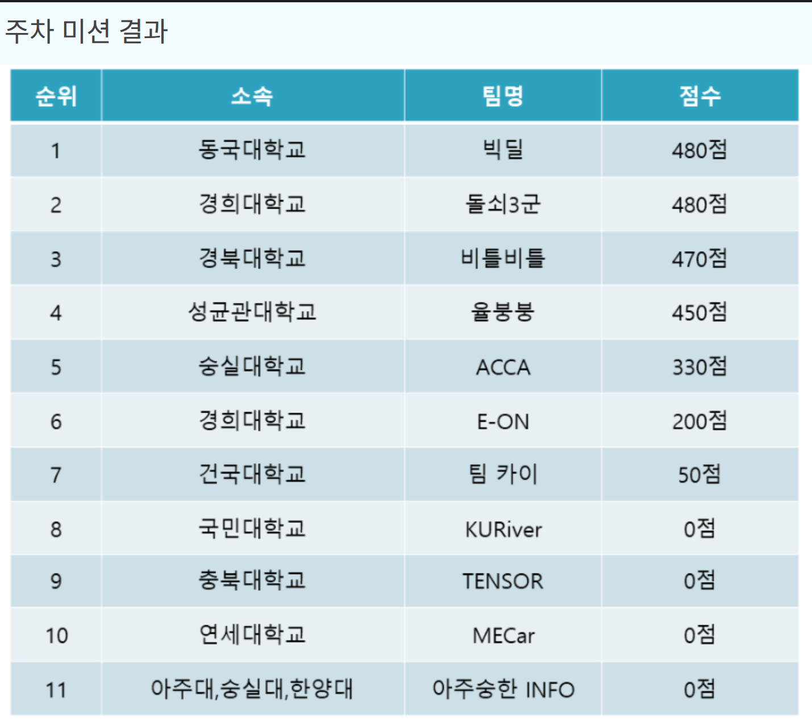

## Projects

### [VLP-16 + CV7 3D Mapping & NDT Localization](https://github.com/junseo5777/3D_SLAM)

VLP-16 LiDAR와 CV7 IMU를 활용해 FAST-LIO2 기반 3D mapping 및 NDT map localization 시스템을 ROS 2로 구현했습니다.

* VLP-16 organized point cloud 전처리와 역방향 장착 IMU의 초기 좌표 정렬
* voxel 기반 3D 점군 지도 생성 및 free-space 관측을 활용한 동적 잔상 제거
* FAST-LIO2 local odometry와 비동기 NDT map matching을 결합한 전역 위치 추정
* 추적 단절 시 단계적 재탐색·복구와 보정 속도 제한을 통한 안정적인 base_link pose 출력

### [2026 KMU - Final](https://github.com/junseo5777/2026_KMU/tree/final)

카메라와 LiDAR 기반 자율주행 시스템에서 DWA를 활용한 경로 후보 생성 및 라바콘 장애물 회피 로직을 개발했습니다.

* Bicycle Model 기반 조향 후보 궤적 생성
* LiDAR 원시 스캔 데이터를 활용한 장애물 비용 함수 설계
* DWA 후보 경로 및 최종 선택 경로 RViz marker 시각화

### [2026 KMU - Parking](https://github.com/junseo5777/2026_KMU/tree/parking)

국민대학교 자율주행 주차경기를 위해 Cartographer Mapping, Amcl Localization 및 주차 경로 계획 시스템을 구현했습니다.

* LiDAR/IMU와 Cartographer를 활용한 연습 공간 2D 지도 생성
* LiDAR ICP Odometry와 AMCL 기반 차량 위치 및 방향 추정
* Hybrid A* 기반 전진 및 후진 주차 경로 생성
* START, Parking A, Parking B 순차 주행 미션 구성

### [국제 대학생 EV 자율주행 경진대회](https://github.com/junseo5777/jeju-ev-autonomous-driving-contest)

DWA 기반 경로 생성 알고리즘과 Pure Pursuit과 Stanley 알고리즘을 fusion한 제어 알고리즘을 설계했습니다.

* DWA 최적화 코스트 함수 설계
* DWA 관련 파라미터 최적화
* 제어 파라미터 최적화
* Pure Pursuit / Stanley 기반 path tracking

### [MORAI Link-Based Driving Context & Candidate Path](https://github.com/junseo5777/morai_link)

MORAI MGeo 정밀도로지도와 차량 위치를 결합해 현재 도로 상태와 주행 후보 경로를 생성하는 MACARON 8의 link 기반 planning 계층을 개발했습니다.

* 634개 link와 480개 node의 좌표 변환, graph 구성 및 최근접 선분 검색 index 구현
* UTM 위치·yaw·route·인접 차로를 이용한 현재 link 추정과 10회 연속 관측 기반 전환 안정화
* 현재 차로 유지 및 좌·우 차선변경을 위한 약 40m center/Bezier 후보 경로 생성
* 정지선·신호등·제한속도·교차로·고속도로·톨게이트 등 도로 문맥 생성
* link 기반 후방 목표점, 가상 중앙선, 동적 객체의 차로 상대 위치 생성

### Wood Moisture Detection System

Arduino 기반 목재 수분 및 부식 위험 감지 장치를 제작했습니다.

* 전극 저항 기반 수분 측정
* Piezo 센서 기반 타격 반응 분석
* 목재 상태 DRY / MIDDLE / WET 분류

### [Solar Irradiance Prediction Project](https://github.com/junseo5777/nins_prediction_obic)

대용량 환경 센서 데이터를 기반으로 태양광 일사량을 예측하는 AI 모델링 프로젝트입니다.

* 약 1,900만 행의 시계열 데이터 전처리 및 분석
* 결측치가 많은 데이터 환경에서 보간 및 정합성 처리
* LightGBM 기반 일사량 예측 모델 구축
* 위치 기반 군집화와 기후 기반 군집화를 활용한 특징 생성
* 태양 고도 및 야간 마스킹을 반영한 물리 정보 기반 예측 보정

---

## Awards

### 제5회 국제 대학생 EV 자율주행 경진대회 / 자율주행 모빌리티 경진대회 1/5 scale
* 수상 내용 : 장려상
* 주최 : 국제e모빌리티엑스포 
* 기간 : 2026.03.24 - 03.27

 

### 제9회 국민대학교 자율주행 경진대회 / 주차경기

* 수상 내용 : 특별상
* 팀명 : 빅딜
* 주최 : 국민대학교 SW중심대학사업단
* 주관 : 자이트론
* 기간 : 2026.08.25

